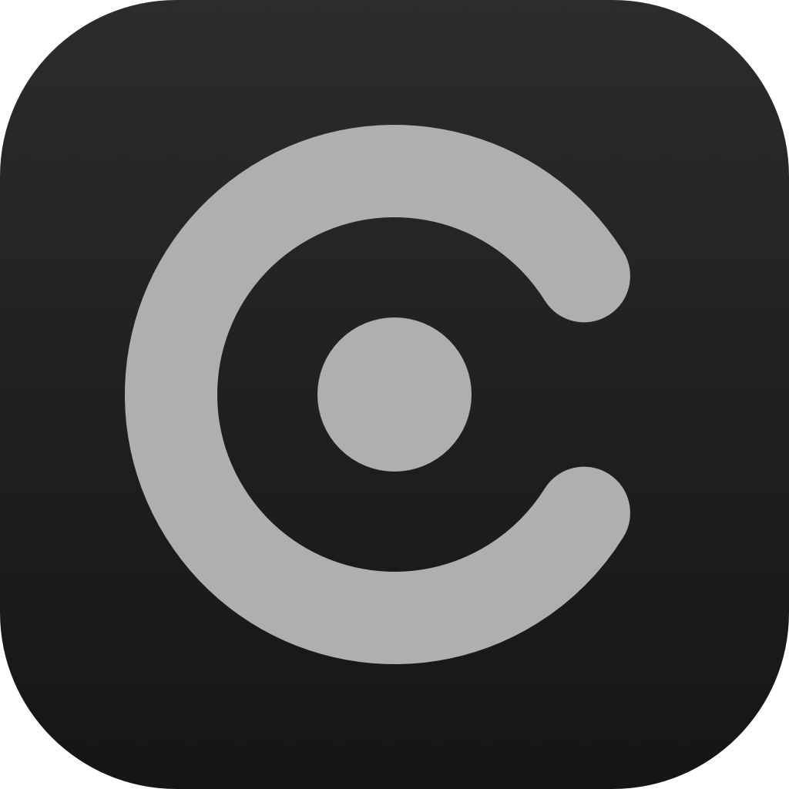

<div align="center">
  
  <h1>Aura</h1>
  <p>A native macOS browser built with SwiftUI, AppKit and WebKit.</p>
</div>

<p align="center">
  <a href="https://www.apple.com/macos/"></a>
  <a href="https://swift.org"></a>
  <a href="LICENSE"></a>
  <a href="https://github.com/Sowyu/Aura/releases/latest"></a>
</p>

## Review status

Aura is experimental. The [code audit](AUDIT.md) records security and correctness
fixes, checks that ran, and remaining work. The last recorded audit run passed
[macOS CI](https://github.com/Sowyu/Aura/actions/runs/34097390651), including Debug and
Release builds and native WebKit tests. Validation for the current development branch
is still in progress, and manual platform checks remain before release.

## Install

1. Download `Aura-<version>.dmg` from the [latest release](https://github.com/Sowyu/Aura/releases/latest).
2. Open the DMG and drag Aura to Applications.
3. On the first launch, right-click Aura and choose Open.

Step 3 is needed once. The app is signed with an Apple Development certificate and is
not notarized, so Gatekeeper blocks a plain double-click the first time. Later versions
arrive through the in-app updater and do not need it.

Runs on macOS 15 or later, Apple Silicon and Intel.

## Features

### Browsing

- Spaces: sidebar workspaces, each with its own set of tabs
- Vertical tab sidebar with folders, pinned tabs and favourites
- Responsive launcher over search, history, open tabs and commands (type `>` for
  commands)
- Bookmarks and reading list, with import from Chrome, Firefox, Edge and Safari, and
  HTML export
- Session restore with crash recovery
- Per-site zoom, find in page, picture in picture, history panel
- Reload changes to a stop button while a page is loading
- Interface animation follows the system Reduce Motion setting

### Privacy and extensions

- Browsing containers in the Firefox style, each with its own cookie jar
- Web extensions from addons.mozilla.org through WKWebExtension, including grants for
  private windows and automatic add-on updates
- uBlock Origin Lite is bundled. Full uBlock Origin is a switch in Settings, Privacy.
  Its custom request-blocking bridge currently runs only outside private windows
- Password vault with autofill, stored in the Keychain
- Per-site JavaScript rules, native camera and microphone prompts, site info on the
  lock icon

### Files and pages

- Downloads with a queue
- Reader mode, view source, save page as a web archive, full-page screenshot
- Local files and inline PDFs, with a file tray

### Keyboard

- Aura-defined shortcuts are rebindable in Settings. macOS-owned Quit, Hide and
  standard Edit commands remain system shortcuts
- Defaults include ⌘T for the launcher, ⌘L for the address bar and ⌘P to print. In
  compact mode, ⌘L opens the launcher with the current URL
- Page shortcuts include per-site zoom, bookmarking, the bookmarks bar, reader mode
  and view source

## Updates

Aura checks for updates at launch and every six hours. When one is out, an
"Update to x.y.z" button appears in the toolbar and in Settings, About. One click
downloads it, installs it and relaunches. Automatic checks can be turned off in
Settings, About.

## Build from source

Needs macOS 15 or later and Xcode 26, or the current beta.

```bash
brew install xcodegen trash-cli
git clone https://github.com/Sowyu/Aura.git
cd Aura
./scripts/setup.sh
open Aura.xcodeproj
```

`scripts/setup.sh` installs the tooling and the git hooks, then generates
`Aura.xcodeproj` from `project.yml`. Run `xcodegen` again after any change to
`project.yml`.

Build and release cleanup uses `trash-put` for recoverable removal. The helper also
finds Homebrew's keg-only [trash-cli](https://formulae.brew.sh/formula/trash-cli) installation.

Portable checks, on Linux or macOS with Node.js 22 or later:

```bash
bash scripts/check-local.sh
```

Tests:

```bash
xcodebuild test -scheme aura -destination "platform=macOS"
```

`scripts/xctest-debug.sh` runs the same build-and-test pair as CI and the pre-push hook.

## Releasing

```bash
scripts/release.sh 1.0.1 --notes notes.md
```

The script builds a signed Release DMG, signs it for Sparkle, writes the appcast and
publishes the GitHub release. It needs `gh` logged in, an Apple Development identity,
and the Sparkle EdDSA key in the login keychain.

## Docs

- [CONTRIBUTING.md](CONTRIBUTING.md), setup and the workflow for a change
- [ROADMAP.md](ROADMAP.md), what is planned
- [SECURITY.md](SECURITY.md), secrets, signing keys and reporting
- [CODE_OF_CONDUCT.md](CODE_OF_CONDUCT.md)
- [THIRD_PARTY_NOTICES.md](THIRD_PARTY_NOTICES.md)

## License

GPL-3.0, see [LICENSE](LICENSE). Third-party components keep their own terms, listed in
[THIRD_PARTY_NOTICES.md](THIRD_PARTY_NOTICES.md).
